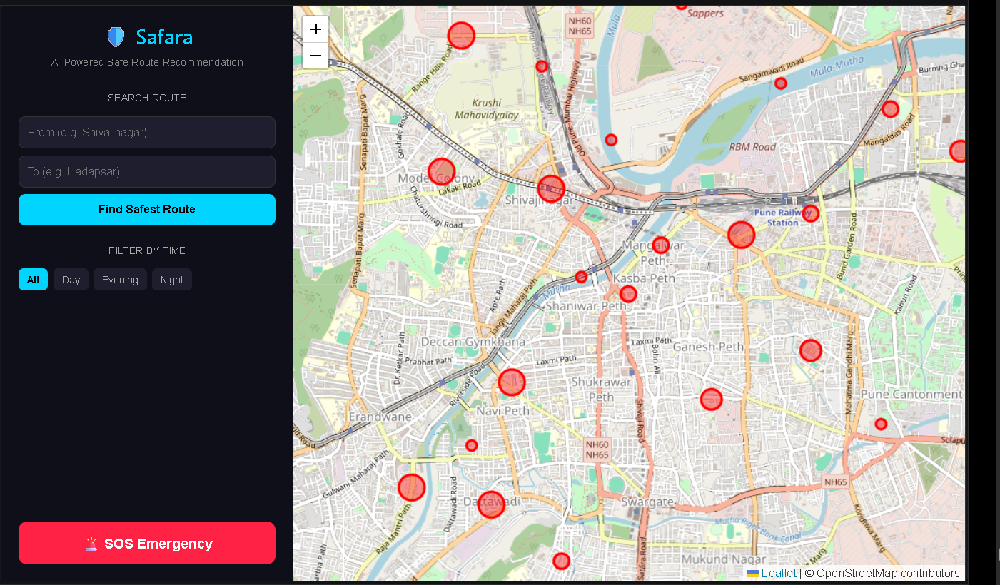
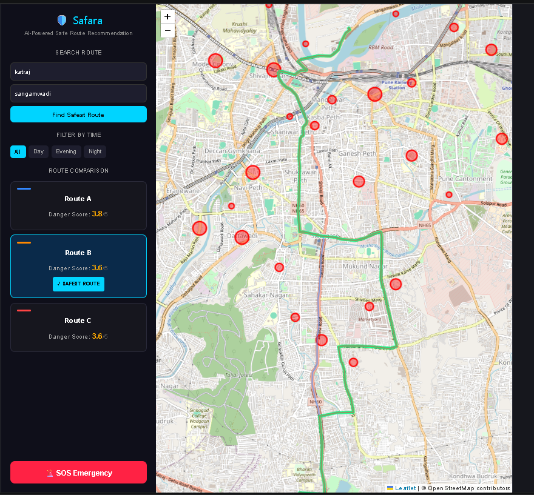
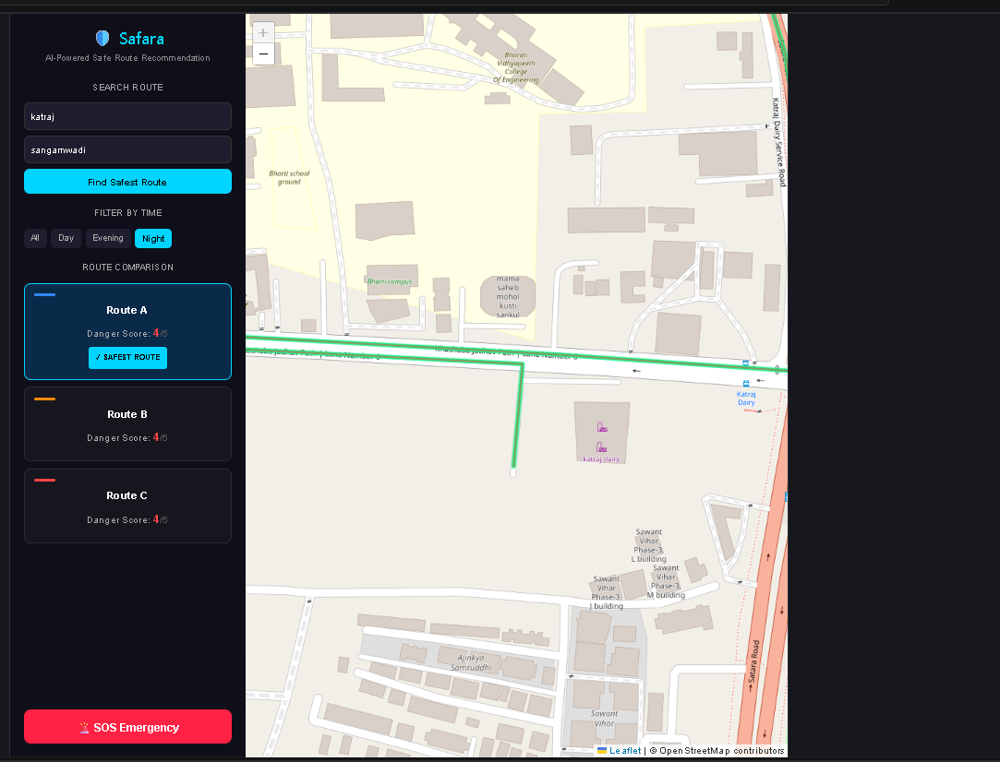

# Safara 🛡️

Safara is a safe route recommendation web application that helps users find safer travel paths using crime hotspot analysis and real-time route comparison.

---

## Features

- Multiple alternative route generation
- Crime hotspot visualization on interactive maps
- Custom danger-scoring system
- Real-time route comparison
- Live location tracking
- Nearby hospital and police safe spot integration
- Responsive UI with interactive map overlays

---

## Screenshots

### Home Interface

### Day Route Recommendation

### Night Route Recommendation

---

## Tech Stack

- React
- Vite
- JavaScript
- Leaflet
- OpenRouteService API
- OpenStreetMap
- Git & GitHub

---

## How It Works

1. User enters source and destination
2. OpenRouteService API generates multiple route options
3. Crime hotspot data is analyzed for each route
4. A custom danger score is calculated
5. The safest route is highlighted on the map

---

## Installation

Clone the repository:
git clone https://github.com/palakchiraniya03/safara
