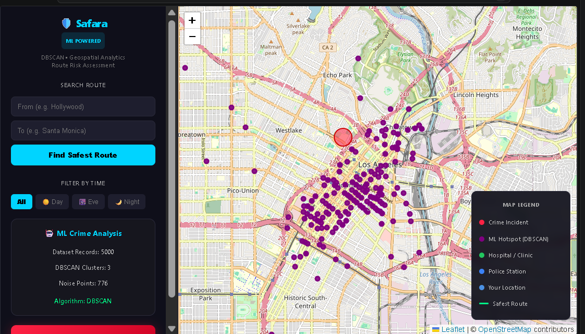
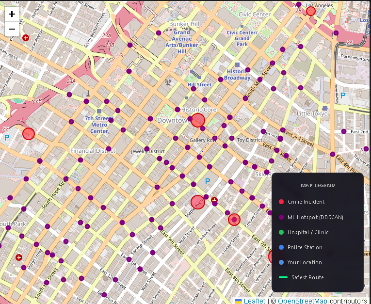
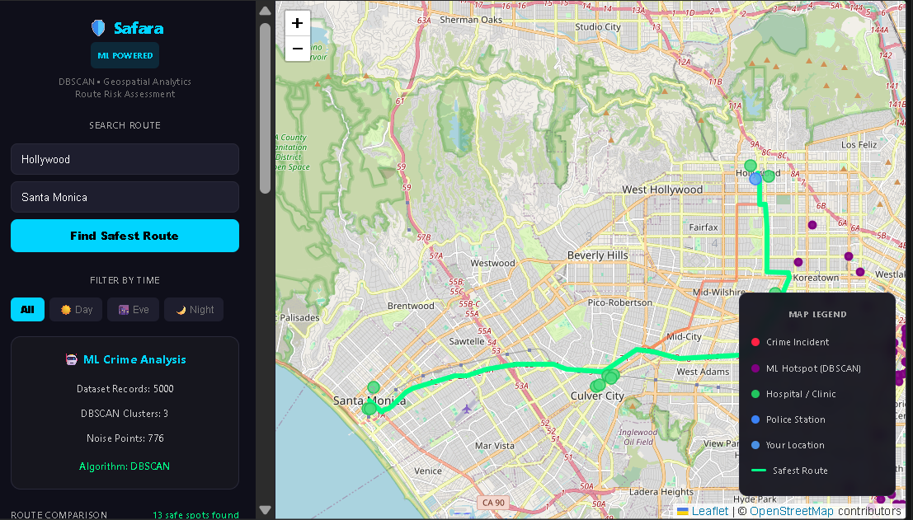
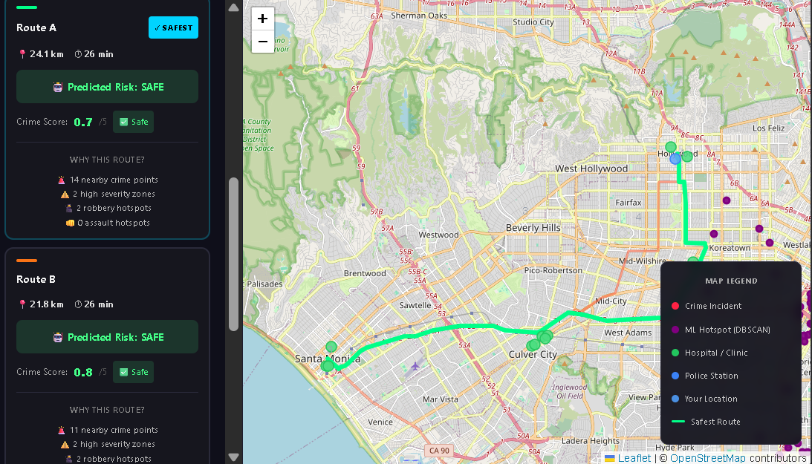
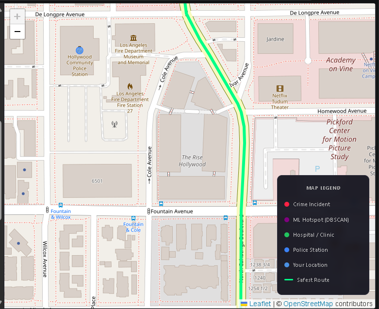

# Safara – ML-Powered Safe Route Recommendation System

## Overview

Safara is a full-stack geospatial analytics platform that recommends safer travel routes using crime hotspot detection and route risk assessment.

The system combines machine learning, geospatial visualization, and route planning to help users identify safer travel paths and nearby emergency resources.

---

## Key Features

* DBSCAN-based crime hotspot detection
* ML-powered crime analytics dashboard
* Safe route recommendation and comparison
* Route risk assessment based on crime density
* Nearby hospital and police station discovery
* Interactive map visualization using Leaflet
* Flask REST API backend

---

## Machine Learning Pipeline

Crime Dataset (5000+ Records)

↓

Data Cleaning & Coordinate Processing

↓

DBSCAN Clustering (Scikit-Learn)

↓

Crime Hotspot Detection

↓

Flask REST API

↓

React + Leaflet Dashboard

↓

Route Risk Assessment

---

## Tech Stack

### Frontend

* React
* Vite
* Leaflet

### Backend

* Flask
* Pandas

### Machine Learning

* Scikit-Learn
* DBSCAN Clustering

---

## Screenshots

### ML Crime Analytics Dashboard

### DBSCAN Hotspot Detection

### Safe Route Recommendation

### Route Risk Analysis

### Safe Spots Discovery

---

## Future Improvements

* Crime trend forecasting
* Time-series hotspot analysis
* Multi-city support
* Real-time crime feeds
* Advanced route optimization

---

## Author

Palak Chiraniya
